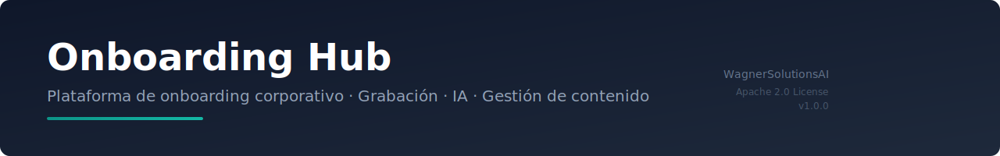

<div align="center">
  
</div>

<p align="center">
  <a href="https://wagnersolutionsai.com">
    
  </a>
  <a href="LICENSE">
    
  </a>
  <a href="https://github.com/SebaWag/onboarding-hub/releases/tag/v1.0.0">
    
  </a>
  <a href="https://academy.wagnersolutionsai.com">
    
  </a>
</p>

---

# 📚 Onboarding Hub

**Plataforma de onboarding corporativo** con grabación de tutoriales, inteligencia artificial y gestión de contenido. Diseñada para que equipos de RRHH, L&D y operations puedan crear, gestionar y distribuir programas de onboarding interactivos con video, evaluación y seguimiento en tiempo real.

> 🚀 Desarrollado por [WagnerSolutionsAI](https://wagnersolutionsai.com) — Digitalización soberana para empresas.

---

## ✨ Características

### 🎥 Grabación de Tutoriales
- Grabación simultánea de **pantalla + cámara** con picture-in-picture circular
- **Fondo virtual**: Matrix Rain, colores sólidos, blur, y **detección de piel** para background removal (sin IA externa)
- Generación automática de portadas con FFmpeg
- Renombrado y organización de videos

### 🤖 Inteligencia Artificial
- **Chat contextual** sobre los videos — los alumnos preguntan y la IA responde sobre el contenido
- **Transcripción automática** con Whisper
- Asistente IA para creación de programas de onboarding

### 📊 Gestión de Contenido
- Biblioteca con búsqueda, vista grid/lista
- Reproductor con chat IA integrado
- **Programas de onboarding** estructurados por módulos
- **Tablero Kanban** para seguimiento de progreso
- **Evaluaciones y quizzes** por módulo

### 📈 Analytics
- Dashboard con KPIs en tiempo real
- Progreso de alumnos por programa
- Métricas de visualización y completitud

### 🎨 Diseño
- **Tema claro/oscuro** con persistencia
- Diseño responsive (mobile-first)
- Sidebar minimalista de 48px
- Interfaz tipo Loom / Notion

---

## 🛠 Stack Tecnológico

| Capa | Tecnología |
|------|-----------|
| **Frontend** | React 19 + Vite + TypeScript + Tailwind CSS |
| **Backend** | Node.js 20 + Express + TypeScript |
| **Base de Datos** | PostgreSQL 15 |
| **Cache** | Redis 7 |
| **Object Storage** | MinIO (S3-compatible) / SeaweedFS |
| **Proxy / SSL** | Traefik v2.11 con Let's Encrypt |
| **IA** | MiMo V2 Omni (chat contextual) + Whisper (transcripción) |
| **Segmentación** | BodyPix (background removal sin IA externa) |

---

## 🚀 Inicio Rápido

### Prerrequisitos
- Docker y Docker Compose v2
- Git
- Un dominio con DNS apuntando a tu servidor (opcional para SSL)

### Instalación

```bash
# 1. Clonar el repositorio
git clone https://github.com/SebaWag/onboarding-hub.git
cd onboarding-hub

# 2. Configurar variables de entorno
cp .env.example .env
# Edita .env con tus claves de API y configuraciones

# 3. Iniciar servicios
docker compose up -d

# 4. Verificar que todo está corriendo
docker compose ps
```

### Acceso

| Servicio | URL | Puerto |
|----------|-----|--------|
| **Frontend** | `http://localhost:8090` | 8090 |
| **Backend API** | `http://localhost:4001` | 4001 |
| **MinIO Console** | `http://localhost:9001` | 9001 |
| **Traefik Dashboard** | `http://localhost:8080` | 8080 |

---

## 🐳 Servicios Docker

| Servicio | Container | Puerto |
|----------|-----------|--------|
| Frontend | `onboarding-hub-frontend` | 8090 |
| Backend | `onboarding-hub-backend` | 4001 |
| PostgreSQL | `onboarding-hub-postgres` | 5435 |
| Redis | `onboarding-hub-redis` | 6381 |
| MinIO | `onboarding-hub-minio` | 9000 / 9001 |
| Traefik | `onboarding-hub-traefik` | 80 / 443 |

### Comandos útiles

```bash
# Logs del backend
docker compose logs -f backend

# Rebuild frontend
docker compose build --no-cache frontend
docker compose up -d --force-recreate frontend

# Acceder a la base de datos
docker compose exec postgres psql -U admin -d onboarding_hub

# Detener servicios
docker compose down

# Actualizar desde GitHub
git pull origin main
docker compose up -d --build
```

---

## 📁 Estructura del Proyecto

```
onboarding-hub/
├── backend/
│   └── src/
│       ├── routes/        # API endpoints
│       ├── services/      # Lógica de negocio (AI, storage, whisper)
│       ├── middleware/     # Auth, errores
│       ├── db/            # Base de datos y migraciones
│       └── types/         # TypeScript types
├── frontend/
│   └── src/
│       ├── components/    # Componentes reutilizables
│       ├── pages/         # Páginas de la aplicación
│       ├── hooks/         # Custom hooks (media recorder, theme, etc.)
│       └── lib/           # Utilidades
├── assets/                # Recursos visuales del repo
├── docker-compose.yml     # Infraestructura completa
├── .env.example           # Template de configuración
├── init-ssl.sh            # Script de certificados SSL
├── LICENSE                # Apache 2.0
└── README.md
```

---

## 🤝 Contribuir

¿Te interesa contribuir? ¡Genial! El proyecto está en etapa temprana y toda ayuda suma.

1. Fork el repositorio
2. Crea una rama (`git checkout -b feature/nueva-funcionalidad`)
3. Commit tus cambios (`git commit -m 'feat: agrega nueva funcionalidad'`)
4. Push a la rama (`git push origin feature/nueva-funcionalidad`)
5. Abre un Pull Request

### Reportar bugs
Si encuentras un bug, por favor [abre un issue](https://github.com/SebaWag/onboarding-hub/issues) describiendo:
- Qué esperabas que pasara
- Qué pasó realmente
- Pasos para reproducirlo
- Entorno (navegador, SO)

---

## 📄 Licencia

Este proyecto está bajo la licencia **Apache 2.0**. Ver el archivo [LICENSE](LICENSE) para más detalles.

---

<p align="center">
  Hecho con ❤️ por <a href="https://wagnersolutionsai.com">WagnerSolutionsAI</a>
</p>
